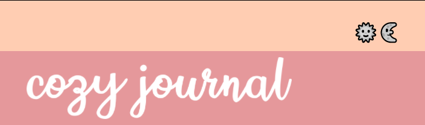

# Cozy Journal

● User-focused web application that allows for a simple and intuitive journaling experience.

● Javascript front-end and Rails/Active Record back-end application.

## Backend

[Link Backend Github](https://github.com/stacysorey/Phase_4_Project_Backend)

## Toggle Light/Dark Mode

● Uses vanilla JavaScript to "toggle" a light/dark mode feature. 

## License
[MIT](https://choosealicense.com/licenses/mit/)